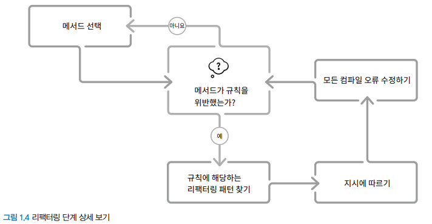

> # Ch 01. 리팩터링 리팩터링하기

리팩터링은 스킬, 문화, 도구 세 구성요소가 합쳐져야 한다.

- 스킬: 어떤 코드에 리팩터링이 필요한지 파악하는 스킬
- 문화: 리팩터링에 시간을 들이는 것을 권장하는 문화
- 도구: 리팩터링의 안전한 결과를 보장할 도구

## 1.1 리팩터링이란 무엇인가?

가장 단순한 형태의 리팩터링은 '기능을 변경하지 않고 코드를 변경하는 것'이다.

리팩터링을 해야 하는 이유는 다음과 같다.

- 코드를 더 빠르게 만들기 위해
- 더 작은 코드를 만들기 위해
- 코드의 재사용성을 높이기 위해
- 코드의 가독성과 유지보수성을 높이기 위해

## 1.3 문화: 리팩터링은 언제 할까?

대부분의 문서는 레드-그린-리팩터 작업 절차를 제안하지만, 이는 리팩터링을 TDD로 유도하기 때문에 매우 복잡하고 어려워진다.

리팩터링에만 초점을 맞추기 위해 프로그래밍 문제 해결 6단계 작업 절차를 따르는 것을 권장한다.

1. 탐색
   - 무엇을 해결해야 할지 확실하지 않을 때는 실험부터 시작해 무엇이 필요한지 찾는다.
2. 명세화
   - 무엇을 만들지 알게 되면 그것을 명세화한다.
   - 최적의 경우는 이를 자동화된 테스트로 만드는 것이다.
3. 구현
   - 명세를 기반으로 코드를 구현한다.
4. 테스트
   - 코드가 2단계의 명세(사양)를 따르는지 확인한다.
5. 리팩터링
   - 코드를 전달하기 전에 다음 사람이 쉽게 작업할 수 있는지 확인한다.
   - 다음 사람이 자신이 될 수도 있으므로 신중하게 작업한다.
6. 전달
   - 전달하는 방법 중 하나는 pull request 또는 특정 브랜치로 push하는 것이다.

이때 리팩터링 단계를 구체화하면 다음과 같다.

### 레거시 시스템에서의 리팩터링

대규모 레거시 시스템에서는 모든 시스템을 중단한 후 코드베이스 전체를 리팩터링할 수 없기 때문에 새 코드를 추가할 때마다 쉽게 추가할 수 있도록 관련 부분을 리팩터링하도록 한다.

### 언제 리팩터링을 하지 말아야 할까?

리팩터링은 시간이 오래 걸리기 때문에 의미 없는 리팩터링은 하지 말아야 한다.

리팩터링이 필요 없는 경우는 다음과 같다.

- 한 번 실행하고 삭제할 코드
- 폐기되기 전 유지보수 모드에 있는 코드
- 임베디드 시스템이나 게임의 고급 물리엔진과 같이 엄격한 성능 요구사항이 있는 코드
