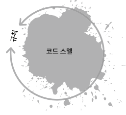

# 소프트웨어 개발에서의 문제

스킬(Skill)
- 어떤 코드가 잘못되었으며 리팩터링이 필요한지를 파악하는 스킬  
- 코드 스멜[^1]에 대한 지식으로 알아낼 수 있다…? ← 판단과 경험 필요
문화(Culture)
- 리팩터링에 시간을 들이는 것을 권장하는 문화와 절차 필요
- 많은 경우 TDD에서 사용되는 Red-Green-Refactor 순환 절차로 구현
도구(Tool)
- 리팩토링을 하는 작업이 안전하다는 것을 보장해야 한다.
- 일반적으로 자동화된 테스트를 통해 실현

위 3가지의 구성 요소의 어딘가가 부족하기에 주로 문제 발생.  
리팩터링은 위 요소들이 모두 필요.

# 1. 리팩터링

- 높은 품질의 코드를 얻는 가장 일반적인 방법
- 기능을 변겅하지 않고 코드를 변경하는 것

## 1.1 리팩터링을 해야 하는 이유

- 더 빠른 코드
- 더 적은 코드
- 재사용 가능한 코드
- 가독성이 좋은 코드 → 유지보수 용이

가독성을 높여 새로운 기능 구현에 필요한 시간 확보  
버그 감소, 수정 용이

## 1.2 무엇을 리팩터링할 것인가?

- 코드 스멜
	- 강력하지만, 추상적이고 보는 감각을 키워야 한다
- 규칙
	- 쉽고 빠르게 학습
	- 때로는 스멜이 없는 코드를 수정 or 수정 이후에도 스멜

## 1.3 리팩터링은 언제 할까?

가장 좋은 시기는 정기적으로 수행하기  
그렇지 않다면 리팩터링에 드는 시간과 돈이 많이 소모될 수 있다.

또한 아래와 같은 상황에서는 리팩터링이 필요하지 않을 수 있다.
- 한 번 실행하고 삭제할 코드 (XP에서의 스파이크)
- 폐기되기 전 유지모수 모드에 있는 코드
- 엄격한 성능 요구사항이 있는 코드 (임베디드, 고급 물리엔진 …)

[^1]: 심오한 문제를 일으킬 가능성이 있는 프로그램 소스코드의 특징