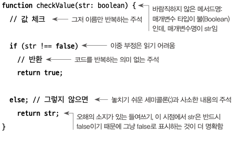
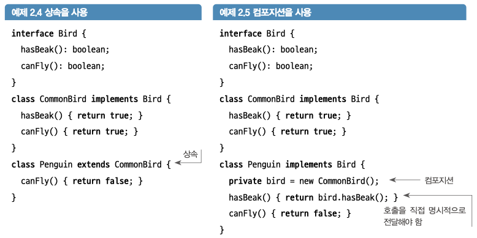

# 리팩터링 정의 복습
> 코드가 하는 일을 변경하지 않고 더 나은 코드를 만드는 것

## 1.1 코드 개선

### 가독성
- 코드가 무슨 일을 하는지 파악하기가 쉬워진다

  
가독성이 떨어지는 코드.

- 바람직하지 않는 메서드명, 매개변수명
- 이중 부정

### 유지보수성

- 버그 수정 또는 기능 추가를 위해 새 코드를 어디에 작성할지 후보 위치(context)를 조사하는 것으로 시작한다. 이때, 유지보수성이 좋을수록 조사해야하는 후보가 적다.

취약성(fragile)
- 어떤 시스템에서 한 군데를 수정하였는데 관련 없는 곳에서 문제가 발생

취약성은 일반적으로 global state로 인한 것인데, 데이터가 전역적일 경우 데이터가 연결된 다른 변수를 통해 누군가가 읽거나 변경할 수 있어 실수로 데이터가 손상되기 때문이다.

변수를 명시적으로 체크해서 불변속성[^1]을 제거할 수 있지만, 이는 코드가 수행하는 작업이 변경되는 것이기에 리팩터링에서 해서는 안된다.

대신 불변속성을 더욱 쉽게 볼 수 있도록 서로 가깝게 이동시켜 유지보수성을 향상시킬 수 있다. (불변속성의 범위제한)

맞는지는 모르겠는데 예시
```java
public class Example {

    // 함수 A: num이 항상 0 이상임을 보장하는 함수
    public void functionA(int num) {
        // num이 0 이상이 아닐 경우 예외 처리 또는 다른 처리 로직을 추가할 수 있음
        if (num < 0) {
            throw new IllegalArgumentException("num은 0 이상이어야 합니다.");
        }

        // 함수 A의 로직
        System.out.println("함수 A 실행 중");

        // 함수 B 호출
        functionB(num);
    }

    // 함수 B: num을 사용하는 함수
    public void functionB(int num) {
        // 여기서는 이미 함수 A에서 num이 0 이상임을 보장받고 있음
        // 따라서 추가적인 조건 확인이 필요 없음
        // 여기에어 다시 검사 로직을 추가하면 래픽터링 원칙 위반...?
        System.out.println("함수 B 실행 중, num = " + num);
    }

    public static void main(String[] args) {
        Example example = new Example();
        Integer num = 5;
        // 함수 A 호출
        example.functionA(num); // num이 0 이상임을 가정하고 호출

        // 잘못된 예시: 함수 A를 0 이하의 값으로 호출할 경우
        example.functionB(num);
    }
}

```

## 1.2 코드가 하는 일을 바꾸지 않고 유지보수하기

- 값을 입력하면 리팩터링 전과 후에 동일한 결과를 얻어야 한다.  
- 다만, 성능이 바뀔 수 도 있다.
	- 대부분의 시스템에서 성능은 가독성과 유지보수성보다 가치가 떨어진다
	- 성능이 중요한 경우 프로파일링 도구나 성능 전문가의 지도를 받아 리팩터링 외 단계에서 수행

## 리팩터링의 세 가지 핵심

- 의도를 전달함으로써 가독성 향상
- 불변속성의 범위제한을 통한 유지보수성 향상
- 범위 밖의 코드에 영향을 주지 않고 1항과 2항을 수행

## 2.1 상속보다는 컴포지션 사용

- 대부분의 리팩터링 패턴과 규칙은 구체적으로 객체 컴포지션을 돕기 위한 것들이다.

  
딱 필요한 기능들만 노출시킬 수 있다…?

- 컴포지션을 중심으로 만들어진 시스템을 사용하면 다른 방식보다 더 깔끔하게 코드를 결합하고 재사용 할 수 있다
- 컴포지션을 사용하면 추가(addition)하는 것으로 변경이 가능하다
	- 기존 코드를 변경하지 않음 → 오류 발생 시 이전 기능으로 빠르게 대체 가능
	- open-closed 원칙


# 요약

1. **리팩터링 정의**:
   - 코드를 변경하지 않고 개선.

2. **코드 개선**:
   - 가독성: 명확한 메서드/변수명, 이중 부정 피하기.
   - 유지보수성: 수정할 후보 위치 줄이기, 취약성 방지.

3. **코드 일관성 유지**:
   - 리팩터링 전후 동일한 결과 유지, 성능은 가독성보다 덜 중요. (일부 그렇지 않은 분야도 존재)

4. **상속보다 컴포지션 사용**:
   - 깔끔하고 재사용 가능한 코드, 기존 코드 변경 없이 확장 가능.

[^1]: 코드에서 상태(조건)를 명시적으로 확인하지 않는 속성
    ex) ‘이 수는 음수일 수 없다'