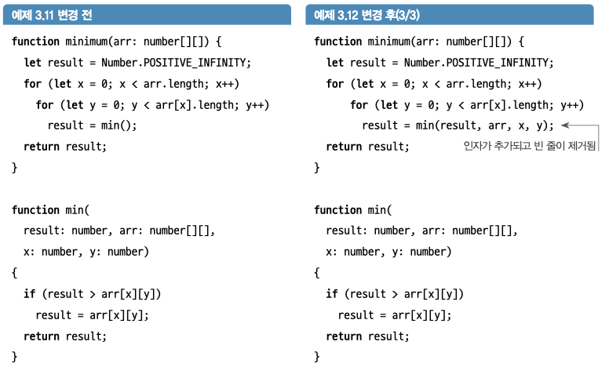
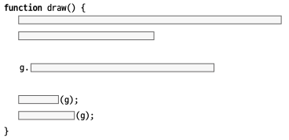

# 3. 긴 코드 조각내기

코드는 쉽게 지저분해지고 혼란스러워질 수 있다.  
이 혼란의 주 원인은 다음과 같다.

- 메서드가 여러 가지 다른 일을 수행한다.
- 낮은 수준의 원시 연산(배열 조작, 산술 연산 등)을 사용한다.
- 주석과 적절한 메서드와 변수명 같이 사람이 읽을 수 있는 텍스트가 부족하다.

## 3.1 리팩터링 규칙 1: 다섯 줄 제한

### 3.1.1 규칙: 다섯 줄 제한
> 메서드는 `{`와 `}`를 제외하고 5줄 이상이 되어서는 안된다.

**스멜**  
- 메서드가 길면 메서드의 모든 논리를 머릿속에 담아야 하기에 작업하기 어렵다.
**의도**
- 각 메서드의 이름으로 코드의 의도를 전달할 수 있기에 빠르고 이해하기 쉽다.
- 메서드의 이름을 지정하는 것은 주석을 넣는 것과 유사하기에 코드의 의도 전달이 쉽다.

다만, 무조건 5줄을 지킬 필요는 없다. 제한이 있다는 것 자체가 중요!

## 3.2 함수 분해를 위한 리팩터링 패턴

### 3.2.1 리팩터링 패턴1: 메서드 추출

1. 동일한 작업을 하는 데 필요한 줄의 그룹을 식별
2. 그룹을 하나의 메서드로 분리
3. 매개변수를 통해 의존성 추가



- 새로운 메서드에서 더 많은 정보를 제공할 수 있는 새로운 이름을 매개변수에 지정해 가독성을 높일 수 있다.

## 3.3 추상화 수준을 맞추기 위한 함수 분해

### 3.3.1 리팩터링 규칙2: 호출 또는 전달, 한 가지만 할 것
> 함수 내에서는 객체에 있는 메서드를 호출하거나 객체를 인자로 전달할 수 있지만, 둘을 섞어 사용해서는 안된다



위 코드에서는 g의 메서드를 호출하기도 하고 g를 함수의 인자로 전달하기도 한다.  
동일한 추상화 수준을 맞추기 위해서는 

```typescript
function createG() {
	...
	g = ...
	return g;
}

function draw() {
	const g = createG();
	functionA(g);
	functionB(g);
}
```


## 3.4 좋은 함수 이름의 속성

- 함수의 의도를 설명할 수 있어야 한다
- 함수가 하는 모든 것을 담아야 한다
- 도메인에서 일하는 사람이 이해할 수 있어야 한다
	- 작업 중인 도메인에서 사용하는 단어 사용
	- 팀원 및 고객과의 원활한 의사소통

```javascript
// 입력을 받아 움직이는 로직과 맵을 업데이트하는 함수
function update() {
    // 입력 처리 및 움직임 로직
    console.log("입력을 처리하고 움직입니다. 입력값:", "키보드 입력 값");
    
    // 맵 업데이트 로직
    console.log("맵을 업데이트합니다.");
}
```

```javascript
// 맵을 업데이트하는 함수
function updateMap() {
    // 맵 업데이트 로직
    console.log("맵을 업데이트합니다.");
}

// 입력을 처리하고 처리된 결과에 따라 움직이는 로직을 수행하는 함수
function handleInput(input) {
    // 입력 처리 및 움직임 로직
    console.log("입력을 처리하고 움직입니다. 입력값:", input);
}

// update 함수 예시
function update() {
    // 입력을 받아 움직이는 로직
    // handleInput 함수 호출
    handleInput("키보드 입력 값");
    
    // 맵 업데이트 로직
    updateMap();
}
```

update함수의 내부 로직이지만, input의 경우 입력값 자체를 업데이트 하는 것이 아니기에 handle이라는 용어를 사용하였다.

## 3.5 너무 많은 일을 하는 함수 분리하기

### 3.5.1 리팩터링 규칙3: if 문은 함수의 시작에만 배치
> if 문이 있는 경우 해당 if 문은 함수의 첫 번째 항목이어야 한다.

무언가를 확인하는 것 역시 하나의 작업이기에  
함수가 한 가지 일만 해야 한다는 원칙을 지키기 위해서는 if 문이 함수의 첫 번째 항목이어야 한다.


# 요약

1. **다섯 줄 제한**:
   - 메서드는 5줄 이하로 작성하여 가독성 유지.

2. **메서드 추출**:
   - 동일 작업 줄 그룹을 새로운 메서드로 분리.

3. **추상화 수준 맞추기**:
   - 객체 메서드 호출과 인자 전달을 분리하여 사용.

4. **좋은 함수 이름**:
   - 함수의 의도를 명확히 설명하고, 도메인에서 이해할 수 있는 단어 사용.

5. **if 문 위치**:
   - if 문은 함수의 시작 부분에 배치.