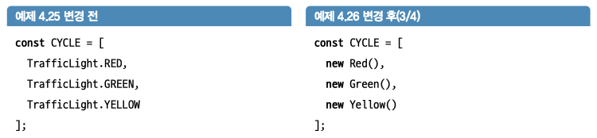
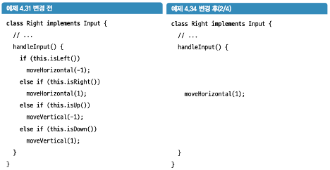
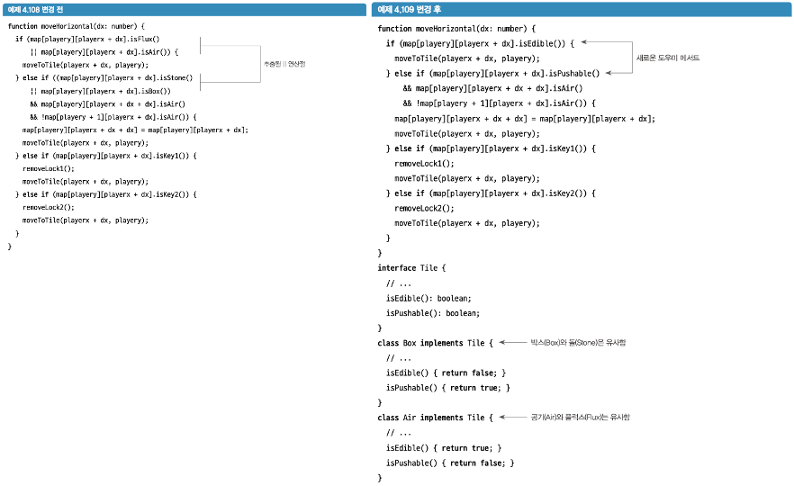

# 1. if문 리팩터링

### 1.1 규칙: if 문에서 else를 사용하지 말 것
> 프로그램에서 이해하지 못하는 타입인지를 검사하지 않는 한 if 문에서 else 를 사용 X

if-else를 사용하면 코드에서 결정이 내려지는 지점이 고정된다.  
그럴 경우 다른 변형을 도입할 수 없기 때문에 코드의 유연성이 떨어진다.  
(단, 외부에서 입력을 받는 프로그램의 경계에서 발생하는 경우는 ㄱㅊ)

- if문: 검사(check)로 간주
- if-else문: 의사결정(decision)으로 간주

→ if는 흐름을 제어한다. 그러나 객체지향 프로그래밍에는 `객체`라는 강력한 제어 흐름 연선자가 있기에 보다 더 강력하고 유연한 도구인 객체를 사용하도록 변경

### 1.2 규칙 적용하기

1. Enum에서 Interface로 변경하기
2. 값을 클래스로 만들기
3. if 구문 내의 코드를 각 클래스의 메서드로 옮기기

### 1.3 패턴: 클래스로 타입 코드 대체
> 열거형을 인터페이스로, 열거형의 값들을 클래스로


### 1.5 패턴: 클래스로의 코드 이관
> 특정 값과 연결된 기능이 값에 해당하는 클래스로 이동

if 구문이 제거되고 기능이 데이터에 더 가까이 이동  


### 1.7 패턴: 메서드의 인라인화
> 프로그램에서 더 이상 가독성에 도움이 되지 않는 메서드를 제거

- 주로 메서드가 한 줄만 있는 경우 이 작업을 수행
- 추출한 메서드가 잘못 사용될 여지가 있다면 메서드 인라인화 고려
- 메서드로 전재하는 것이 가독성에 도움이 된다면 인라인화 X
```typescript
function absolute(x: number) {
	return (x ^ x >> NUMBER_BITS-1) - (x >> NUMBER_BITS-1);
}
```

# 2. 긴 if 문의 리팩터링

### 2.2 패턴: 메서드 전문화
> 일반화를 줄이고 좀 더 특정화한 버전의 함수를 도입하는 과정

- 지나치게 일반화된 메서드는 리팩터링을 방해할 수 있다.

일반화하고 재사용하려는 프로그래머의 본능에 반하지만, 더 적은 위치에서 호출되어 필요성이 없어지면 더 빨리 제거할 수 있다.

```javascript
function canMove(start, end, dx, dy); // 룩, 비숍, 나이트 모두 사용하는 함수

// 메서드 전문화를 적용

function rookCanMove(start, end);
function knightCanMove(start, end);
```

### 2.4 규칙: switch를 사용하지 말 것
> default case가 없고 모든 case에 반환 값이 있는 경우가 아니라면 switch를 사용하지 않을 것

- 새로운 값을 추가할 때 switch에서 적절하게 case 정의를 하지 않으면 컴파일러가 새로운 값의 처리를 잊어버린건지 알 수 없음
- fall-through[^1] 로직인 switch의 특징으로 실수 가능성
- default를 사용하지 않는 것이 좋음


# 3. 코드 중복 처리

### 3.1 인터페이스 대신 추상 클래스를 사용할 수는 없을까?

추상 클래스를 통해 코드의 중복을 피할 수 있지만  
새로운 클래스를 만들 때 실수로 오버라이드 하는 것을 잊어버릴 수 있다.

그래서 나용 규칙이 바로  
‘인터페이스에서만 상속받을 것’ 이다.

### 3.2 규칙: 인터페이스에서만 상속받을 것
> 상속은 오직 인터페이스를 통해서만 받을 것

- 추상 클래스를 사용하면 중복을 줄이고 코드의 줄을 줄이는데 도움이 된다
- 하지만 코드 공유는 커플링을 유발한다.
	- 가능한 모든 하위 클래스에서 메서드가 필요한 경우 클래스 밖으로 메서드 분리가 쉽다.
	- 일부 하위 클래스에서만 재정의를 해야 한다면 컴파일러를 통해 재정의가 필요한 메서드인지 잡아낼 수 없다..

# 4. 복잡한 if 체인 구문 리팩터링

메서드 전체를 옮기는 대신 조건에 일치하는 메서드의 부분만 클래스로의 코드 이관  


# 5. 필요 없는 코드 제거하기

### 5.1 패턴: 삭제 후 컴파일하기
> 메서드를 삭제하고 컴파일하여 사용되는 메서드인지 확인

- 아직 사용하고 있지 않은 것일 수 있으므로 새로운 기능 구현 중에는 이 패턴을 수행하지 말것


[^1]: break 키워드를 만나기 전까지 케이스를 연속해서 실행한다.