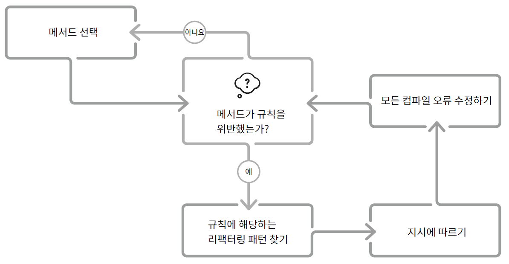

# 리팩터링 리팩터링하기

## 1.1 리팩터링이란 무엇인가?

### **리팩터링**

> 기능을 변경하지 않고 코드의 가독성과 유지보수가 쉽도록 코드를 변경하는 것

- 리팩터링을 해야 하는 이유
  - 코드를 더 빠르게 만들기 위해
  - 더 작은 코드를 만들기 위해
  - 코드를 더 일반적이거나 재사용 가능하게 하기 위해
  - 코드의 가독성을 높이고 유지보수를 용이하게 하기 위해
- **좋은 코드**
  > 사람이 읽기 쉽고, 유지보수가 용이하며, 의도한 대로 잘 동작하는 코드
- 리팩터링을 하는 이유
  - 코드베이스의 가독성을 높이면 새로운 기능을 구현하기 위한 시간을 확보할 수 있어 경제적이다.
  - 유지보수가 용이해지면 버그가 줄어들고 수정이 쉬워진다.
  - 좋은 코드베이스는 생각하기 편하기 때문이다.

## 1.2 스킬 : 무엇을 리팩터링할 것인가?

- 코드 스멜
  > 코드가 나쁘다는 것을 암시하는 것
- 코드 스멜의 예
  - 함수는 **한가지 작업**을 수행해야 한다

## 1.3 문화 : 리팩터링은 언제 할까?

- 정기적으로 수행하는 것이 효과적이고 비용이 적게 들기 때문에 일상 업무에 통합하는 것이 좋다.
- 이 책에서는 리팩터링 부분에 초점을 맞추고 6단계 작업 절차를 권장한다.
  - 탐색 → 명세화 → 구현 → 테스트 → 리팩터링 → 전달
- 리팩터링 단계
  
- 레거시 시스템에서의 리팩터링
  > “우선 변경하기 쉽게 만든 후 변경하라” - 켄트 벡
  - 새로운 것을 구현할 때마다 새 코드를 쉽게 추가할 수 있게 리팩터링을 먼저 한다.
- 언제 리팩터링을 하지 말아야 할까?
  - 한 번 실행하고 삭제할 코드
    - 익스트림 프로그래밍 커뮤니티에서 **스파이크**로 알려진 것
  - 폐기되기 전 유지보수 모드에 있는 코드
  - 임베디드 시스템이나 게임의 고급 물리엔진과 같이 엄격한 성능 요구사항이 있는 코드
