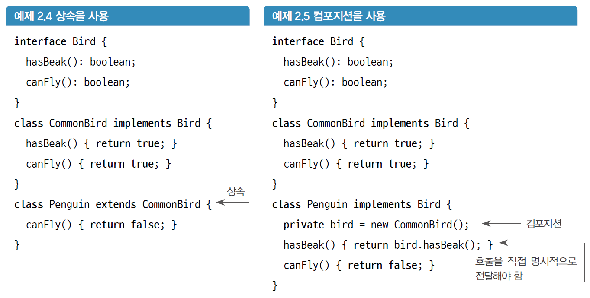

# 리팩터링 깊게 들여다보기

## 2.1 가독성 및 유지보수성 향상

### 2.1.1 코드 개선

- **가독성**
  - 의도를 전달하기 위한 코드의 성질
  - 코드가 의도한 대로 작동한다는 가정이 있으면 코드가 무슨 일을 하는지 파악하기 매우 쉽다.
  - 코딩 컨벤션 적용, 주석 달기, 변수, 메서드, 클래스 및 파일 이름 지정, 공백 사용 등
- **유지보수성**
  - 버그를 고치거나 기능을 추가하기 위해 일부 기능을 변경해야 할 때마다 새 코드를 놓을 후보 위치(context)를 얼마나 많이 조사해야 하는지를 나타내는 표현
  - 취약 시스템
    - 한 군데에서 무언가를 수정하면 다른 곳에서 문제가 발생하는 시스템
    - 이 취약성의 근원은 일반적으로 전역상태이다.
  - 불변속성
    - 코드에서 상태(조건)를 명시적으로 확인하지 않는 속성
    - 변수를 명시적으로 체크하여 불변속성을 제거함으로써 유지보수성을 향상시킬 수 있다.
    - 코드가 수행하는 작업이 변경되는 경우 서로 가깝게 이동시켜 유지보수성을 향상시킨다. 이것을 <b>불변속성의 범위제한(localizing invariants)</b>이라고 한다.

### 2.1.2 코드가 하는 일을 바꾸지 않고 유지보수하기

- 값을 입력하면 리팩터링 전과 후에 동일한 결과를 얻어야 한다.
- 리팩터링 중인 코드를 예약하여 병합 충돌을 예방한다.
- 리팩터링의 핵심
  - 의도를 전달함으로써 가독성 향상
  - 불변속성의 범위제한을 통한 유지보수성 향상
  - 범위 밖의 코드에 영향을 주지 않고 1항과 2항을 수행

## 2.2 속도, 유연성 및 안정성 확보

### 2.2.1 상속보다는 컴포지션 사용

- 대부분의 리팩터링 패턴과 규칙은 구체적으로 **객체 컴포지션**을 돕기 위한 것들이다.
  
  - 위의 예시에서 `Bird`에 새로운 메서드 `canSwim`을 추가한다면 두 경우 모두 `CommonBird`에 이 메서드가 추가된다.
  - 예제 2.5의 컴포지션 예에서는 `Penguin`이 새로운 메서드 `canSwim`을 구현하지 않기 때문에 컴파일 오류가 발생한다.
  - 예제 2.4의 상속 예에서는 `Penguin`에서 `canSwim`을 override해야 한다는 것을 작업자가 기억해야 한다. 이 경우 문제가 발생할 수 있다.
- 유연성
  - 컴포지션을 중심으로 만들어진 시스템을 사용하면 다른 방식보다 더 깔끔하게 코드를 결합하고 재사용 할 수 있다.

### 2.2.2 수정이 아니라 추가로 코드를 변경

- 컴포지션의 가장 큰 장점은 <b>추가(addition)</b>로 변경이 가능하다는 것이다.
  - 기존 기능에 영향을 주지 않고 기능을 추가하거나 변경할 수 있다.
- **개방-폐쇄(open-closed) 원칙**
  - 소프트웨어 구성 요소들은 확장에 대해 열려 있어야 하고, 수정에 대해 닫혀 있어야 한다.
- 프로그래밍 속도
  - 새로운 것을 구현하거나 버그를 수정할 때 다른 코드를 건들지 않고 변경한다면 시간을 아낄 수 있다.
  - 어떤 코드가 사용되고 사용되지 않는지 주의를 기울이고, 사용하지 않는 코드는 최대한 빨리 삭제해야 한다.
- 안정성
  - 추가에 의한 변경 방식을 따르면 기존 코드를 항상 보존할 수 있다.
  - 불변속성의 범위를 제한해 오류를 줄이는 것에 더해 시스템의 안정성이 향상된다.

## 2.3 리팩터링과 일상 업무

- 기술 부채
  - 코드를 리팩터링하지 않고 전달하기만 하면 다른 프로그래머의 시간을 빼앗는 셈이다.
  - 지금까지 설명한 부정적인 요인들로 인해 열악한 소프트웨어 아키텍처에 대한 이자가 붙는다
