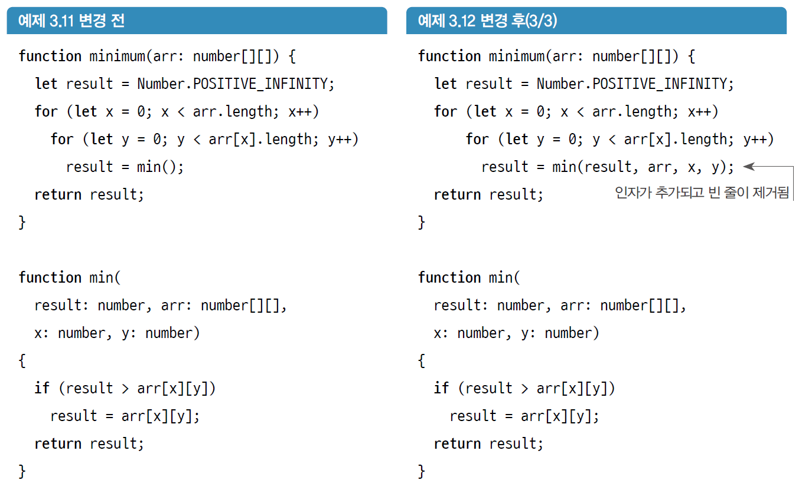
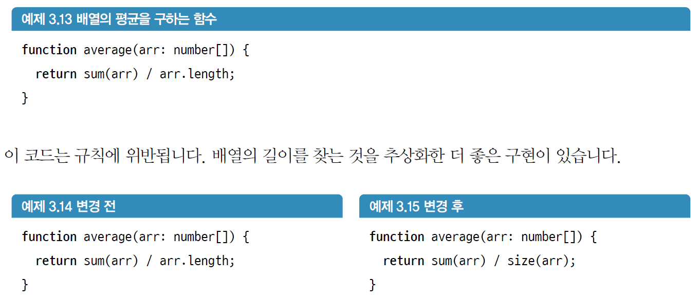
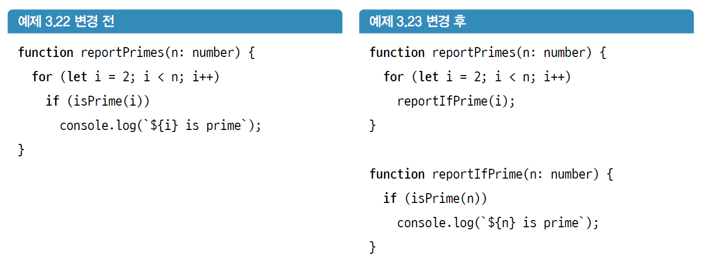

# 긴 코드 조각내기

- 코드가 혼란스러워지는 주 원인
  - 메서드가 여러 가지 다른 일을 수행한다.
  - 낮은 수준의 원시 연산(배열 조작, 산술 연산 등)을 사용한다.
  - 주석과 적절한 메서드와 변수명 같이 사람이 읽을 수 있는 텍스트가 부족하다.

## 3.1 첫 번째 규칙 : 왜 다섯 줄인가?

### 3.1.1 규칙 : 다섯 줄 제한

- 정의
  - 메서드는 `{`와 `}`를 제외하고 5줄 이상이 되어서는 안된다.
- 설명
  - **문장**이라고도 하는 코드 한 줄은 하나의 `if`, `for`, `while` 또는 세미콜론으로 끝나는 모든 것
- 스멜
  - 한 번에 긴 메서드의 모든 논리를 머릿속에 담아 작업하기는 어렵다.
  - 메서드는 한 가지 작업만 해야 한다.
- 의도
  - 시간이 지나면서 많은 기능이 추가되면 메서드가 커진다.
  - 5줄의 코드가 있는 4개의 메서드가 20줄인 하나의 메서드보다 빠르고 이해하기 쉽다.

## 3.2 함수 분해를 위한 리팩터링 패턴 소개

- 코드를 이해하기 위한 첫 번째 단계는 항상 함수명을 고려하는 것이다.
- 동일한 작업을 하는 데 필요한 줄의 그룹을 식별한다.

### 3.2.1 리팩터링 패턴 : 메서드 추출

- 설명
  - **메서드 추출**은 한 메서드의 일부를 취해서 자체 메서드로 추출하는 것이다.
- 절차
  1. 추출할 줄의 주변을 빈 줄로 표시하는데, 주석으로 표시할 수도 있다.
  2. 원하는 이름으로 새로운 빈 메서드를 만든다.
  3. 그룹의 맨 위에서 새로운 메서드를 호출한다.
  4. 그룹의 모든 줄을 선택해서 잘라내어 새로운 메서드의 본문에 붙여 넣는다.
  5. 컴파일한다.
  6. 매개변수를 도입하여 호출하는 쪽의 오류를 발생시킨다.
  7. 이러한 매개변수 중 하나(`p`)를 반환 값으로 할당해야 할 경우
     1. 새로운 메서드의 마지막에 `return p;` 를 추가한다.
     2. 새로운 메서드를 호출하는 쪽에서 `p = newMethod(…)`와 같이 반환 값을 할당한다.
  8. 컴파일한다.
  9. 호출 시 인자를 전달하여 오류를 잡는다.
  10. 사용하지 않는 빈 줄과 주석을 제거한다.
- 예제
  

## 3.3 추상화 수준을 맞추기 위한 함수 분해

### 3.3.1 규칙 : 호출 또는 전달, 한 가지만 할 것

- 정의
  - 함수 내에서는 객체에 있는 메서드를 호출하거나 객체를 인자로 전달할 수 있지만 둘을 섞어 사용해서는 안 된다.
- 설명
  - 더 많은 메서드를 도입하고 여러 가지를 매개변수로 전달하기 시작하면 책임이 고르지 않게 될 수 있다.
  - 동일한 수준의 추상화를 유지하는 편이 코드를 읽기 쉽다.
    
- 스멜
  - 함수의 내용은 동일한 추상화 수준에 있어야 한다.
- 의도
  - 메서드에서 몇 가지 세부적인 부분을 추출해서 추상화를 도입할 때 이 규칙은 연관된 다른 세부적인 부분도 추출하게 한다.
  - 이렇게 하면 메서드 내부의 추상화 수준이 동일하게 유지된다.

## 3.4 좋은 함수 이름의 속성

- 정직해야 한다. 함수의 의도를 설명해야 한다.
- 완전해야 한다. 함수가 하는 모든 것을 담아야 한다.
- 도메인에서 일하는 사람이 이해할 수 있어야 한다. 작업 중인 도메인에서 사용하는 단어를 사용하면 의사소통을 효율적으로 할 수 있고, 팀원 및 고객과 코드에 대해 더 쉽게 이야기할 수 있다.

## 3.5 너무 많은 일을 하는 함수 분리하기

### 3.5.1 규칙 : `if` 문은 함수의 시작에만 배치

- 정의
  - `if` 문이 있는 경우 해당 `if` 문은 함수의 첫 번째 항목이어야 한다.
- 설명
  - 함수는 한 가지 일만 해야하고, 무언가를 확인하는 것은 한 가지 일이다.
  - 따라서 함수에 `if`가 있는 경우 함수의 첫 번째 항목이어야 한다. 또한, 그 후에 아무것도 해서는 안 된다.
  - 아래의 변경 전 예시에서는 두 가지 작업이 존재하기 때문에 함수를 분리한다
    - 숫자를 반복한다.
    - 숫자가 소수인지 확인한다.
      
- 스멜
  - 다섯 줄 제한과 같이, 이 규칙은 함수가 한 가지 이상의 작업을 수행하는 스멜을 막기 위해 존재한다.
- 의도
  - `if` 문이 하나의 작업이기 때문에 이어지는 `else if`는 `if` 문과 분리할 수 없는 원자 단위로 본다.
