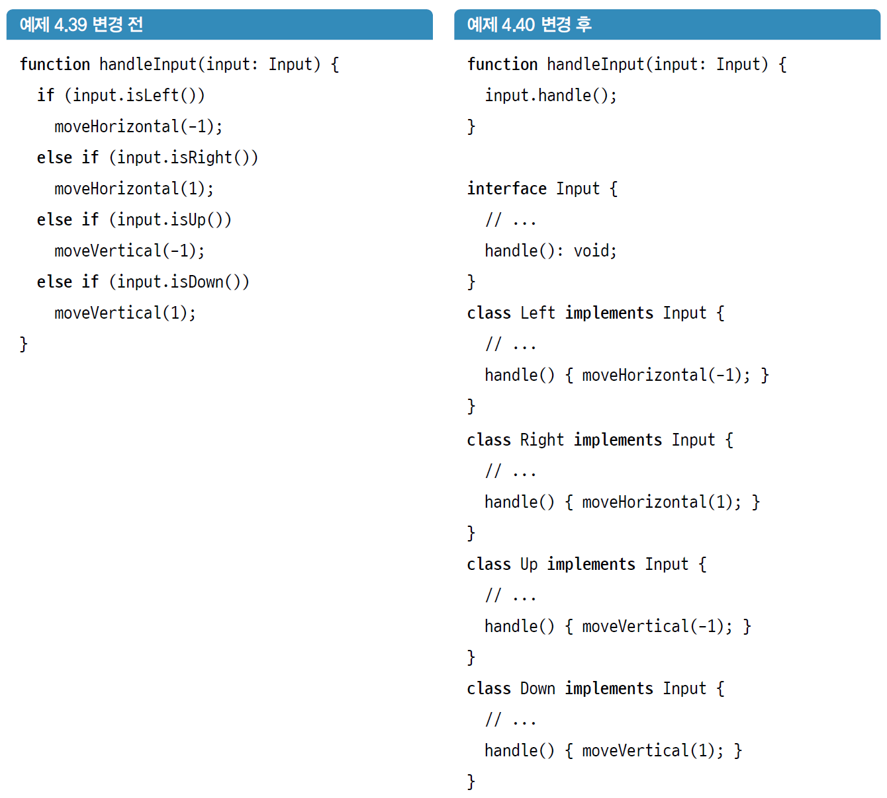

# 타입 코드 처리하기

## 4.1 간단한 if 문 리팩터링

### 4.1.1 규칙 : if 문에서 else를 사용하지 말 것

- 정의
  - 프로그램에서 이해하지 못하는 타입(형)인지를 검사하지 않는 한 if문에서 else를 사용하지 않는다.
    
- 설명
  - if-else를 사용하면 코드에서 결정이 내려지는 시점을 고정하게 된다.
  - 그럴 경우 if-else가 있는 위치 이후에서는 다른 변형을 도입할 수 없어 코드의 유연성이 떨어진다.
- 스멜
  - 이 규칙은 **이른 바인딩(ealry binding)**과 관련이 있다.
  - 프로그램을 컴파일할 때 if-else 같은 의사결정 동작은 컴파일 시 처리되어 애플리케이션에 고정되며 재컴파일 없이는 수정할 수 없다.
  - 이것의 반대는 코드가 실행되는 순간에 동작이 결정되는 **늦은 바인딩(late binding)**이다.
- 의도
  - if는 조건 연산자로 흐름을 제어한다.
  - 그러나 객체지향 프로그래밍에는 객체라는 훨씬 강력한 제어 흐름 연산자가 있다. 이 규칙은 더 강력하고 유연한 도구인 객체를 사용하는 방안을 찾게 한다.

### 4.1.2 규칙 적용

- 열거형(enum)에서 인터페이스(interface)로 바꾼다.
- 값들은 클래스로 바뀐다.
- 값이 객체가 되었기 때문에 if 구문 내의 코드를 각 클래스의 메서드로 옮길 수 있다.

### 4.1.3 리팩터링 패턴 : 클래스로 타입 코드 대체

- 열거형을 인터페이스로 변환하고 열거형의 값들은 클래스가 된다.
- 열거형에 새 값을 추가하는 것은 수많은 파일에 걸쳐 해당 열거형과 연결된 로직들을 확인해야 한다.
- 인터페이스를 구현한 새로운 클래스를 추가하는 것은 해당 클래서에 메서드의 구현이 필요할 뿐, 새로운 클래스를 사용하기 전까지는 다른 코드를 수정하지 않아도 된다.

### 4.1.5 리팩터링 패턴 : 클래스로의 코드 이관

- if문이 제거되고 기능이 데이터에 가까이 이동한다.
- 특정 값과 연결된 기능이 값에 해당하는 클래스로 이동하기 때문에 불변속성을 지역화하는데 도움이 된다.

### 4.1.7 리팩터링 패턴 : 메서드의 인라인화

- 프로그램에서 가독성에 도움이 되지 않는 메서드를 제거한다.
- 메서드의 인라인화를 수행할 때는 모든 호출 측을 수정하여 원래의 메서드를 제거해야 한다.
- 메서드가 한 줄만 있는 경우 수행한다.
  - 한 줄인 메서드를 인라인화하면 다섯 줄 제한 규칙을 위반하지 않는 다.

- 메서드가 인라인화하기에 너무 복잡하지 않을 때 수행한다.

## 4.2 긴 if 문의 리팩터링

### 4.2.2 리팩터링 패턴 : 메서드 전문화

- 코드를 일반화하고 재사용하면 책임이 흐려지고 다양한 위치에서 코드를 호출할 수 있기 때문에 문제가 될 수 있다.
- 전문화된 메서드는 더 적은 위치에서 호출되어 필요성이 없어지면 더 빨리 제거할 수 있다.
- 절차
  1. 전문화하려는 메서드를 복제한다.
  2. 메서드 중 하나의 이름을 새로 사용할 메서드의 이름으로 변경하고 전문화하려는 매개변수를 제거(또는 교체)한다.
  3. 매개변수 제거에 따라 메서드를 수정해서 오류가 없도록 한다.
  4. 이전의 호출을 새로운 것을 사용하도록 변경한다.
     

### 4.2.4 규칙 : switch를 사용하지 말 것

- default case가 없고 모든 case에 반환 값이 있는 경우가 아니라면 switch를 사용하지 않는다.
- switch가 허용하는, 버그로 이어지는 “편의성”
  - switch로 case를 분석할 때 모든 값에 대한 처리를 실행할 필요가 없다.
    - switch를 사용할 경우 무엇을 처리할지와 처리하지 않을지는 불변속성이다.
    - 기본값이 지정된 다른 경우와 마찬가지로 새로운 값을 추가할 때 이러한 불변속성이 여전히 유효한지 컴파일러를 통해 판단할 수 없게 된다.
  - break 키워드를 만나기 전까지 케이스를 연속해서 실행하는 폴스루(fall-through) 로직이다.
- 이러한 문제를 고치기 위해
  - 기능을 default에 두지 않는다.
  - 모든 케이스에 return을 지정해서 폴스루 문제를 해결한다.

## 4.3 코드 중복 처리

### 4.3.1 인터페이스 대신 추상 클래스를 사용할 수는 없을까?

- 사용할 수 있고, 코드의 중복을 피할 수 있다.
- 인터페이스를 사용하면 이를 통해 도입한 각각의 새로운 클래스에 대해 능동적으로 무엇인가를 해야한다.
  - 잘못해서 속성을 잊어버리거나, 해서는 안되는 오버라이드를 방지할 수 있다.
- 이러한 개념은 매우 중요해서 추상 클래스를 사용하지 못하도록 **인터페이스에서만 상속받을 것**이라는 규칙으로 공식화하기도 한다.

### 4.3.2 규칙 : 인터페이스에서만 상속받을 것

- 상속은 오직 인터페이스를 통해서만 받는다.
- 추상 클래스를 사용하는 일반적인 이유는 일부 메서드에서는 기본 구현을 제공하고, 다른 메서드는 추상화하기 위함이다.
- 그러나 코드 공유는 커플링(결합)을 유발한다.
  - 가능한 모든 하위 클래스에서 기본 구현된 메서드가 필요한 경우 메서드를 클래스 밖으로 쉽게 이동할 수 있다.
  - 일부 하위 클래스에서 메서드를 재정의해야 하는 경우, 기본 구현이 있기 때문에 컴파일러를 통해 재정의가 필요한 메서드인지 잡아낼 수 없다.
