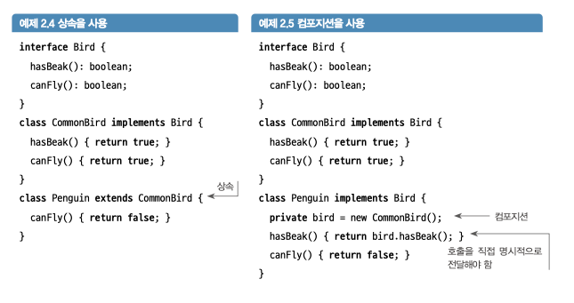

# 2장 리팩터링 깊게 들여다보기

## 코드 개선

가독성 : 의도를 전달히기 위한 코드 성질

어떻게 ?

코딩 컨벤션 지정, 주석 달기, 변수, 메서드, 클래스 및 파일 이름 지정, 공백 사용, '함께 변하는 것은 함께 있어야 한다' 불변속성의 범위제한 등등

리팩터링 세 가지 핵심

1. 의도를 전달함으로써 가독성 향상
2. 불변속성의 범위제한을 통한 유지보수성 향상
3. 범위밖의 코드에 영향을 주지않고 1항과 2항을 수행 (예약)

## 속도, 유연성 및 안정성 확보

### 상속보다는 컴포지션 사용

대부분의 리팩터링 패턴과 규칙은 구체적으로 객체 컴포 지션을 돕기 위한 것

새로운 메서드를 bird에 추가하는 한다면

컴포지션 같은 경우 컴파일 오류가 발생해 강제적으로 메서드를 추가하게 만듬

상속 쓰면 ? 오버라이드 해야하는데 까먹을 수 있음

컴포지션은 큰 장점은 추가로 변경 가능

개방 - 패쇄 원칙을 준수할 수 있음

### 리팩터링과 일상 업무

"코드를 항상 더 좋게 만들고 떠나라" - 지종권 - ㅈㅅ 하다가 정신 나감

이것이 바로 뽀인또

### 소프트웨어 분야에서 '도메인' 정의하기

도메인 : 실제 세계의 구성요소의 소프트웨어
