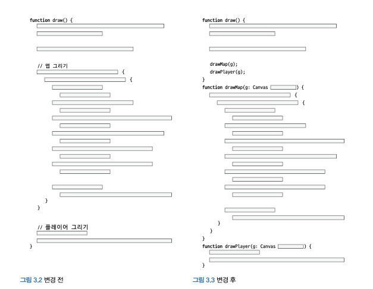
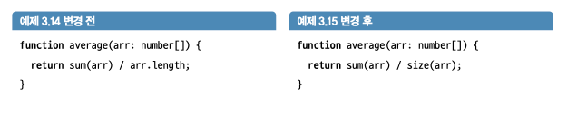
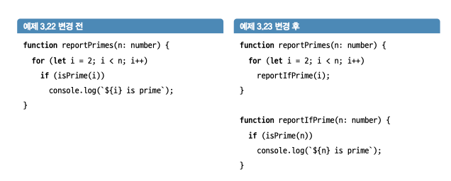

# 긴 코드 조각내기

## 첫 번째 규칙 : 왜 다섯 줄인가 ?

특정 수치로 줄 수를 제한하는 것보다 제한이 있다는 것 자체가 중요합니다.
경험상 기본 데이터 구조 를 탐색하는 데 필요한 값으로 제한을 설정하는 것이 효과적입니다.

-> 그럼 항상 5줄이여야 하나 ? 흠

-> 그렇지 않겠지만 그럼 어떨 때 5줄을 넘겨야 하나 ?

## 함수 분해를 위한 리팩터링 패턴 소개

우선 코드의 '형태'를 살펴보자

그림 보면 알겠지만 코드를 전혀 신경 쓰지 않고 그저 행동에 따라 나누었다

이걸 메서드 추출이라고 부르는 표준패턴이다.

### 절차

1. 추출할 줄의 주변을 빈 줄로 표시하는데,주석으로 표시할 수도 있습니다.

2. 원하는 이름으로 새로운 빈 메서드를 만듭니다.

3. 그룹의 맨위에서 새로운 메서드를 호출합니다.

4. 그룹의 모든줄을 선택해서 잘라내어 새로운 메서드의 본문에 붙여넣습니다.

5. 컴파일합니다.

6. 매개변수를 도입하여 호출하는 쪽의 오류를 발생시킵니다.

7. 이러한 매개변수 중 하나(p라고합시다)를 반환값으로 할당해야 할 경우:

   - 새로운 메서드의 마지막에 return p;를 추가합니다.

   - 새로운 메서드를 호출하는 쪽에서 p = newMethod(...)와 같이 반환 값을 할당합니다.

8. 컴파일합니다.

9. 호출시인자를전달해서오류를잡습니다.

10. 사용하지 않는 빈 줄과 주석을 제거합니다.

> 예제에서 36p 38p 에서 굳이 저렇게까지 나눠야 하나 ?

> 메서드 명만 더 헷갈리는 거 같은데 굳이 ?

## 추상화 수준을 맞추기 위한 함수 분해

이것도 굳이 ?

## 너무 많은 일을 하는 함수 분리하기

### if 문은 함수의 시작에만 배치

함수는 한 가지 일만 해야한다.

즉 무언가를 확인하는 것은 한 가지 일이다

고로 if문은 함수에서 하나만 존재한다.

